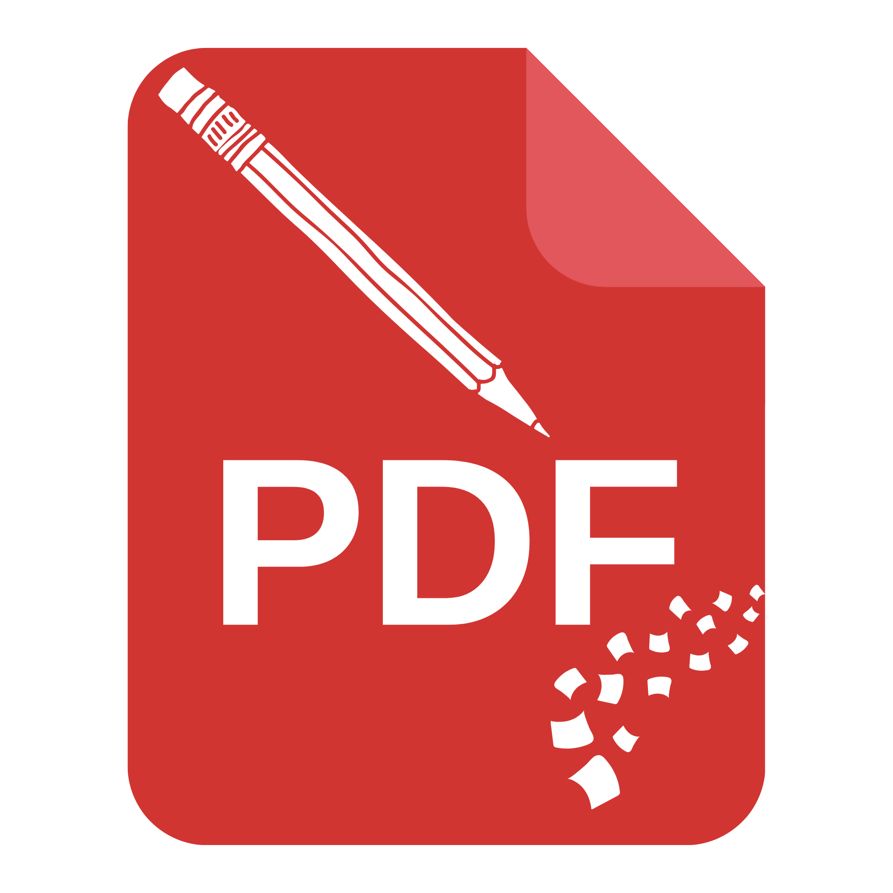
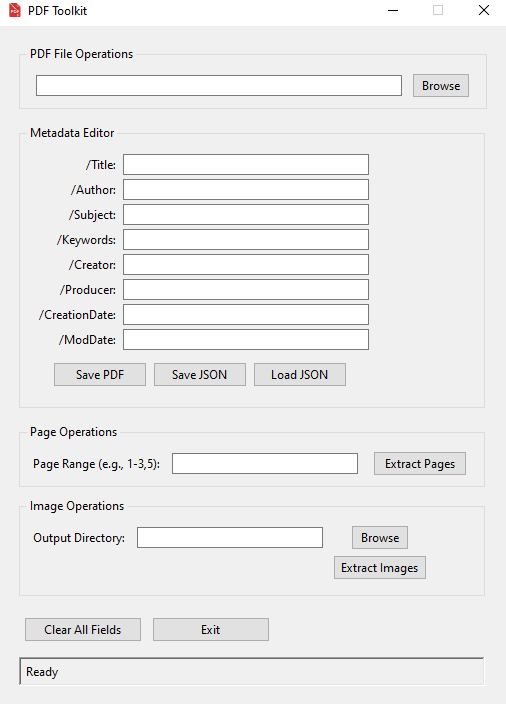
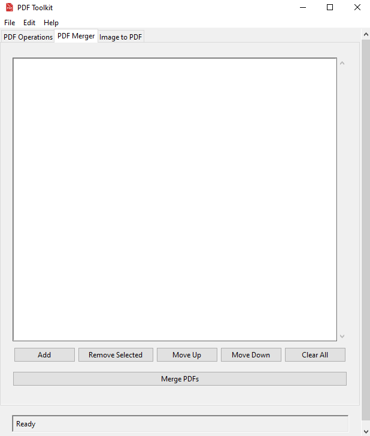
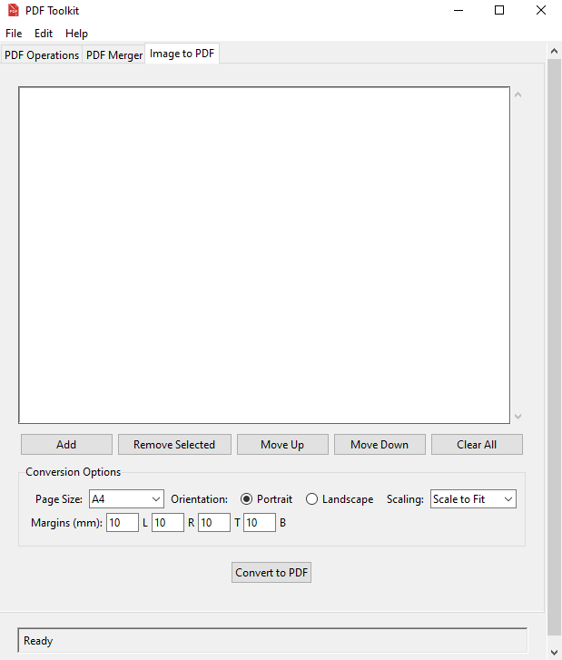

# PDF Toolkit
<p align="center">
    
</p>
PDF Toolkit is a Python application that provides both a graphical user interface (GUI) and a command-line interface (CLI) for performing various operations on PDF files. These operations include editing metadata, extracting pages and images, merging PDFs, and creating PDFs from images.

## Features

- **PDF File Operations**: Load and save PDF files.
- **Metadata Editor**: View and edit PDF metadata fields such as Title, Author, Subject, Keywords, Creator, Producer, Creation Date, and Modification Date.
- **Save and Load Metadata**: Save metadata to a JSON file and load metadata from a JSON file.
- **Page Operations**: Extract specific pages from a PDF file and save them as a new PDF.
- **Image Operations**: Extract images from a PDF file and save them to a specified directory.
- **PDF Merging**: Combine multiple PDF files into a single document.
- **Image to PDF Conversion**: Convert image files to PDF with customizable page settings.
- **Drag and Drop**: Drag and drop PDF files directly into the application for easy loading.
- **Window Centering**: The application window opens centered on the screen.
- **CLI Interface**: Use all features via command-line for batch operations.

## Requirements

- Python 3.7+
- `PyPDF2` library
- `tkinterdnd2` library
- `pillow` library

You can install the required library using the following command:

```
pip install -r requirements.txt
```

## Usage
### **Running the Application (GUI)**

To launch the graphical user interface, execute the following command:
```
python pdftoolkit.py
```

### **Command-Line Interface (CLI)**

The PDF Toolkit CLI supports various operations on PDF files. Below are some usage examples:
#### Read PDF Metadata
```
pdftoolkit_cli.py read example.pdf
```
This command reads the metadata of the specified PDF file.
#### Validate a PDF File
```
pdftoolkit_cli.py validate example.pdf
```
This command checks whether the provided PDF file is valid.
#### Extract Specific Pages
```
pdftoolkit_cli.py extract-pages example.pdf "1-3,5" extracted.pdf
```
Extracts pages 1-3 and page 5 from the PDF and saves them to a new file.
#### Merge Multiple PDFs
```
pdftoolkit_cli.py merge file1.pdf file2.pdf merged.pdf
```
Merges the listed PDF files into a single PDF.
#### Create a PDF from Images
You can specify margins either individually or as a sequence of four values.

**Using Individual Margin Arguments:**
```
pdftoolkit_cli.py create-from-images img1.jpg img2.png output.pdf \
    --margin-left 0 --margin-right 0 --margin-top 0 --margin-bottom 0 \
    --page-size A4 --orientation portrait --scaling "scale to fit"
```

**Using Sequential Margin Values:**
```
pdftoolkit_cli.py create-from-images img1.jpg img2.png output.pdf \
    --margins 0 0 0 0 --page-size A4 --orientation portrait --scaling 1
```
Default margin values (left, right, top, bottom) are 10.

The ```--scaling``` option accepts both text values (e.g., "scale to fit", "stretch to fit", "actual size", "stretch to fill") and integer values (1-4) mapping to these options.


## User Interface

The following image shows the graphical user interface of the PDF Toolkit:

<div align="center">
  <table>
    <tr>
      <td></td>
      <td></td>
      <td></td>
    </tr>
  </table>
</div>