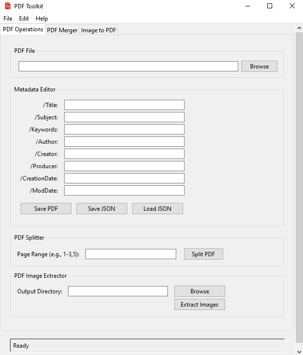

# PDF Toolkit
<p align="center">
    
</p>
PDF Toolkit is a Python application that provides a graphical user interface (GUI) for performing various operations on PDF files, such as editing metadata, extracting pages, and extracting images. The application is built using `tkinter` for the GUI and `PyPDF2` for PDF operations.

## Features

- **PDF File Operations**: Load and save PDF files.
- **Metadata Editor**: View and edit PDF metadata fields such as Title, Author, Subject, Keywords, Creator, Producer, Creation Date, and Modification Date.
- **Save and Load Metadata**: Save metadata to a JSON file and load metadata from a JSON file.
- **Page Operations**: Extract specific pages from a PDF file and save them as a new PDF.
- **Image Operations**: Extract images from a PDF file and save them to a specified directory.
- **Drag and Drop**: Drag and drop PDF files directly into the application for easy loading.
- **Window Centering**: The application window opens centered on the screen.

## Requirements

- Python 3.7+
- `PyPDF2` library
- `tkinterdnd2` library

You can install the required library using the following command:

```sh
pip install -r requirements.txt
```

## Usage
**Running the Application**

To run the application, execute the following command:
```bash
python pdftoolkit.py
```

### User Interface

The following image shows the graphical user interface of the PDF Toolkit:

